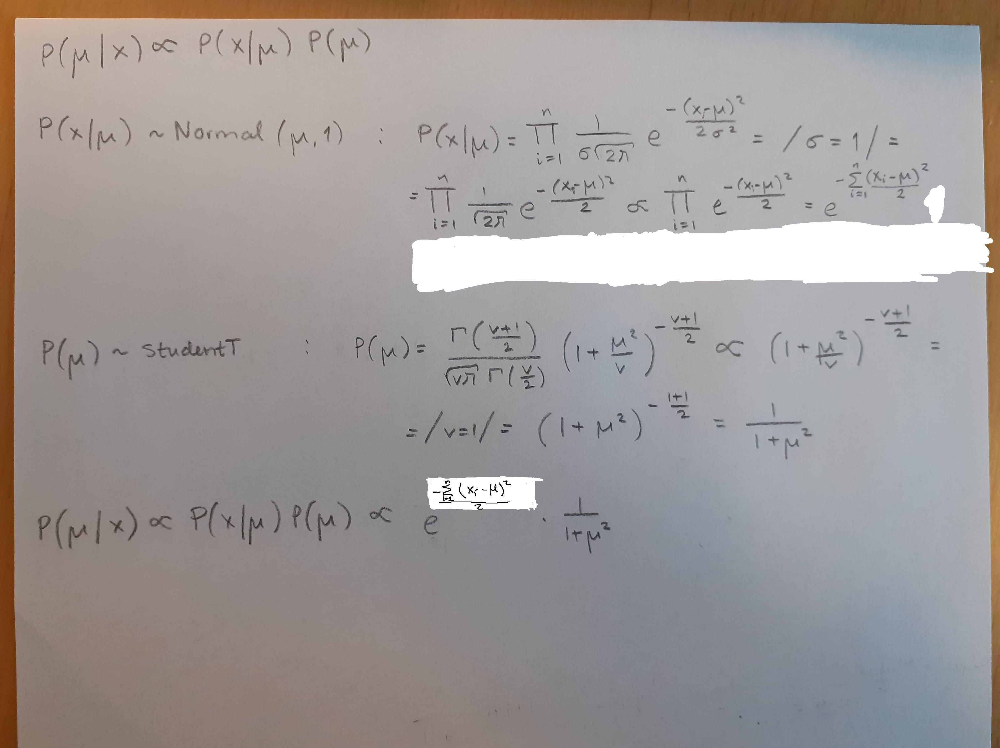

<!-- {r, echo=FALSE, fig.show="hold", out.width="50%"} -->

```{r setup, include=FALSE}
knitr::opts_chunk$set(echo = TRUE)
knitr::opts_chunk$set(collapse = TRUE)
```

\newpage

## Uppgift 3.1.1 *Bayes sats och aposteriorifördelningen: Visualisera posteriorn*

### 1)

``` {r, out.width="50%"}
sigma <- 1
v <- 1
interval <- seq(-5, 15, by=0.5)
prior <- dt(x=interval, df=v)
plot(interval, prior, type="l")
```

### 2)

``` {r}
data <- c(11.3710, 9.4353, 10.3631, 10.6329, 10.4043, 9.8939, 11.5115)
```
``` {r, echo=FALSE, out.width="50%"}
hist(data, xlim=range(-5, 15))
```

### 3)

``` {r}
normal_log_likelihood <- function(mu, data) {
	n <- length(data)
	p1 <- (n/2) * log(2*pi) 
	p2 <- 1/2
	p3 <- sum((data - mu)**2)
	- p1 - p2 * p3
}
```

``` {r, out.width="50%"}
lliks <- c()
for (mu in interval) {
	lliks <- c(lliks, normal_log_likelihood(mu, data))
}

plot(interval, lliks, type="l")
```

### 4)



### 5)

``` {r}
posterior <- lliks * prior
```

``` {r, echo=FALSE, out.width="50%"}
plot(interval, posterior, type="l")
```


\newpage

## Uppgift 3.2.1 *Binomialmodell med beta-prior: Produkt A eller B?*

### 1)

Vi väljer parametrar (samma för både A och B) som gör att Betafördelningen
liknar en normalfördelning, dvs $alpha$ = 2 och $beta$ = 2 (ty de behöver vara
störra än 1 och lika). Detta borde ge att 50% gillar den och 50% inte gör det.

``` {r, out.width="50%"}
alpha <- 2
beta <- 2
random <- rbeta(10000, alpha, beta)
hist(random)
```

### 2)

``` {r}
xA <- c(1, 1, 1, 1, 1, 1, 1, 1, 0, 0, 0, 0, 0)
xB <- c(1, 1, 0)
k <- 1

# Posterior-parametrar
alpha_xA <- alpha + sum(xA)
beta_xA <- beta + length(xA)*k - sum(xA)
alpha_xB <- alpha + sum(xB)
beta_xB <- beta + length(xB)*k - sum(xB)

expected_A <- alpha_xA/ (alpha_xA + beta_xA)
expected_B <- alpha_xB/ (alpha_xB + beta_xB)

expected_A
expected_B
``` 

Produkt A förväntas ha 7 intresserade av 13, medan produkt B förväntas ha 3 av
3 intresserade. Produkt B verkar ha den högsta förväntade proportionen intresserade.

### 3)

``` {r, fig.show="hold", out.width="50%"}
n <- 87
XA <- c()
XB <- c()
for (i in 1:1000) { 
	pA <- mean(rbeta(1, alpha_xA, beta_xA))
	pB <- mean(rbeta(1, alpha_xB, beta_xB))

	XA <- c(XA, rbinom(1, n, pA))
	XB <- c(XB, rbinom(1, n, pB))
}

hist(XA)
hist(XB)
``` 

### 3a)

``` {r}
# Produkt A
sum(XA > 40) / length(XA)
# Produkt B
sum(XB > 40) / length(XB)
``` 

### 3b)

``` {r}
# Produkt A
pA * n
# Produkt B
pB * n
``` 
\newpage

## Uppgift 3.3.1 *Multinomialmodell med Dirichlet-prior: Analys av opinionsundersökningar*

``` {r}
library(gtools)
set.seed(4711)
``` 

### 1)
``` {r}
# Ordningen är baserad på resultatet i valet 2014

# 	 	 		   S       M      SD       MP      C      V       L       KD      FI
valet_2014 <- c(0.3101, 0.2333, 0.1286, 0.0689, 0.0611, 0.0572, 0.0542, 0.0457, 0.0312)
sum(valet_2014)
alpha_guesses <- c( 3.1, 2.3, 1.2, 0.68, 0.69, 0.57, 0.54, 0.46, 0.31)
priori_result <- rdirichlet(n = 1000, alpha = alpha_guesses)
```

```{r, echo=FALSE, fig.show="hold", out.width="33%"}
hist(  priori_result[,1], main = "S")
abline(v = valet_2014[1])
hist(  priori_result[,2], main = "M")
abline(v = valet_2014[2])
hist(  priori_result[,3], main = "SD")
abline(v = valet_2014[3])
```

```{r, echo=FALSE, fig.show="hold", out.width="33%"}
hist(  priori_result[,4], main = "MP")
abline(v = valet_2014[4])
hist(  priori_result[,5], main = "C")
abline(v = valet_2014[5])
hist(  priori_result[,6], main = "V")
abline(v = valet_2014[6])
```

```{r, echo=FALSE, fig.show="hold", out.width="33%"}
hist(  priori_result[,7], main = "L")
abline(v = valet_2014[7])
hist(  priori_result[,8], main = "KD")
abline(v = valet_2014[8])
hist(  priori_result[,9], main = "FI")
abline(v = valet_2014[9])
```

\newpage

### 2)
Vi använder 2020-maj från Sifo

```{r}
# 				S      M     SD      MP     C     V      L     KD   FI
maj_2020 <- c(0.317, 0.186, 0.189, 0.039, 0.072, 0.09, 0.034, 0.061, 0)
round_maj_2020 <- round(maj_2020 * 200)

round_maj_2020
sum(round_maj_2020)
```
På grund av att det finns flera partier med så få röster
så de inte blir medtagna blir det inte precis 200....

### 3)
```{r}
alpha_posterior <- alpha_guesses + maj_2020

uppgiftA  <- 0 
uppgiftB  <- 0
uppgiftC  <- 0
uppgiftD  <- 0
S_results <- c()

n <- 10000

for (i in 1:n) {
    temp <- rdirichlet(n=1, alpha = alpha_posterior)
       
    # Borttagning av partier under 4%-spärren 
    for (i in 1:length(temp)){
        if(temp[i] < 0.04){
            temp[i] = 0
        }
    }
	# Normalisering
    total <- sum(temp)
    for (i in 1:length(temp)){
        temp[i] = temp[i] / total
    }
    
	# För tydlighetens skull
    S  <- temp[1]
    M  <- temp[2]
    SD <- temp[3]
    MP <- temp[4]
    C  <- temp[5]
    V  <- temp[6]
    L  <- temp[7]
    KD <- temp[8]
    FI <- temp[9]
    rödgröna <- S + V + MP
    alliansen <- M + C + L + KD
	
# LÖSNINGAR

# a)
    if (rödgröna > alliansen) { uppgiftA <- uppgiftA + 1 }
    
# b) 
    if (SD > M) { uppgiftB <- uppgiftB + 1 }

# c)
    if (KD < 0.04) { uppgiftC <- uppgiftC + 1 }

# d)
    if (MP < 0.04) { uppgiftD <- uppgiftD + 1 }

# e) 
    S_results <- c(S_results, S)
}

svarA <- uppgiftA / n
svarB <- uppgiftB / n
svarC <- uppgiftC / n
svarD <- uppgiftD / n

# e) ... fortsättning 
	mean <- mean(S_results) 
	sigma <- sd(S_results)
	n <- length(S_results)
	interval_size <- 0.95
	alpha <- 1 - 0.95

	error <- qnorm(1 - alpha/2) * sigma/sqrt(n)
	lower <- mean - error
	upper <- mean + error  
 
# SVAR:
```

a) `r svarA`
b) `r svarB`
c) `r svarC`
d) `r svarD`
e) [`r lower`, `r upper`]

